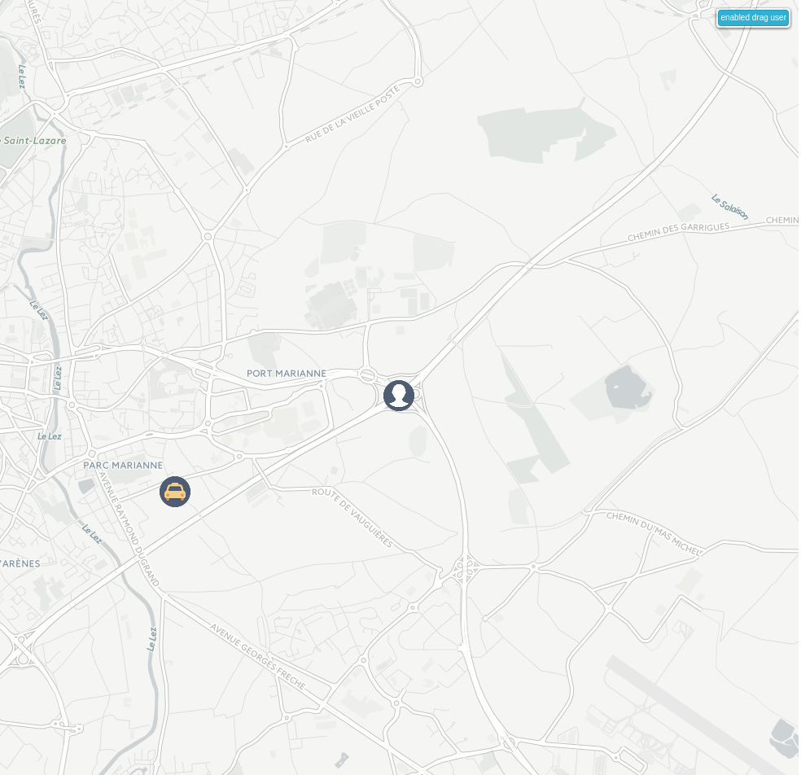

# Kuzzle - Cabble demo

##Description
Cabble is a life-changing web application (demo) for both taxis and their customers.

With Cabble, taxis can easily find customers, without paying booking companies fees. This money saving allow them to improve their level of service up to those of others private transportation companies.

Cabble eases customers life as well: they can now hail a taxi with their fingertip.

Stay tuned! Upcoming versions of Cabble will also include social functionalities like the possibility for customers to rate their taxis, to comment their ride, to share their trip to their favorite social network, and more!

<span>
<div  >Cabble overview : A customer ask a taxi for a ride : </div>  

<a href="./docs/cabble-sketch.png" >
  
  </a >
  
</span>

## What will you learn with this demo ?

Basically in Cabble, an user need to know all the others users in a boundbox around him.
So that's it : you will learn to use <b>the geolocalisation filtering</b> into Kuzzle.
This and all the publications and subscriptions used by Cabble will be described in the
 [step-by-step tutorial](./docs/tutorial.md#sub_to_pos). 

## How the User Interface work ?
A brief overview of Cabble can be found [here](./docs/overview.md).

#How to install Cabble

## Kuzzle + Demo package with Docker Compose

Prerequisites:

* [Docker](https://docs.docker.com/installation/#installation)
* [Docker Compose](https://docs.docker.com/compose/install/)

In this directory you can use the default `docker-compose.yml` with all you need for running Kuzzle container and this demo:

```
$ docker-compose up
```

Now, you can try to use the todolist at http://localhost

## How to run this demo without docker

* You need to have a running [Kuzzle](https://github.com/kuzzleio/kuzzle).
* Configure the `config.js` file for change the Kuzzle URL if you have changed the default Kuzzle installation
* Your webserver must serve index.html (and allow assets,css and lib )
 
# The three Authors

 * [Émilie Esposito](https://twitter.com/emilieesposito)
 * [Sébastien Cottinet](https://github.com/scottinet)
 * [Éric Alvernhe](https://github.com/Ealv)

# The three Cabble Dependancies :

 * [Bluebird](https://github.com/petkaantonov/bluebird) (For Promise Styling)
 * [socketio](http://socket.io/) (For Kuzze communication)
 * [Leafletjs](http://leafletjs.com/) (awesome library for drawing map with OpenStreetMap Database)

# Licence

This demo is published under the [MIT](https://opensource.org/licenses/MIT) licence

# The beautiful icons

https://www.elegantthemes.com/blog/freebie-of-the-week/beautiful-flat-icons-for-free

Under the [GPL](http://www.gnu.org/licenses/gpl-2.0.html) licence.
