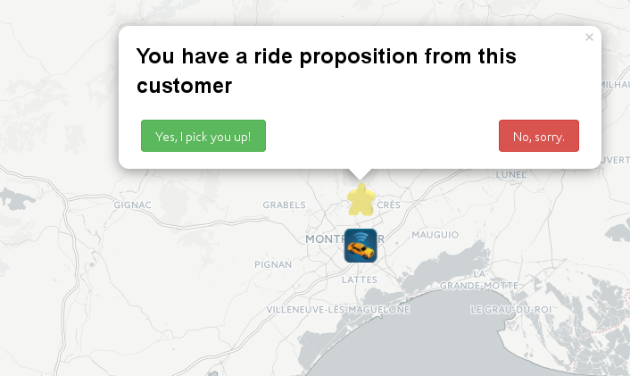
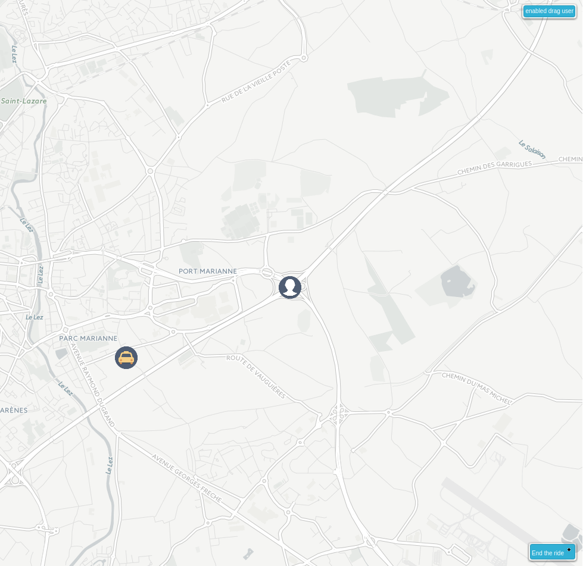

#Sketchup User interface Cabble in three screens.

This is the basic process in three sceens that Cabble rely on.

On Cabble, the user is always centered on the map.
The user can be a taxi or a customer, he will see some candidates (i.e some taxi if you are a customer and vice versa).
The user can propose a ride to a candidate or accept a proposed ride.

Step 1 : The customer see some taxi.

 

Setp 2 : The customer click on the taxi icon and propose a ride with the popped dialog. 

 

Step 3 : The ride has been accepted by the taxi.
A blue button in bottom right position appears on both taxi and customer screen. They can end the ride at anytime.

Well that's it ! you can test the application alone with two browsers by "cheating" on the geolocalisation for both taxi and customer (see next section).

#Without Geolocalisation

Suppose :

 * your navigator has no geolocalisation,
 * you don't want to send your real position,
 * no other user than you use Cabble in your town (it is a shame),
 * you want to test the demo with two browsers, with faking positions for your taxi an customer.

Then you can :

 * click on the top right button,
 * drag your user where you want.

# Iconography

 *  The icon for the customer
 *  A customer asking for a ride
 *  The icon for the customer.
 *  A taxi proposing a ride.
 *  The user has not yet choosen betweeen beeing a customer or a taxi.
