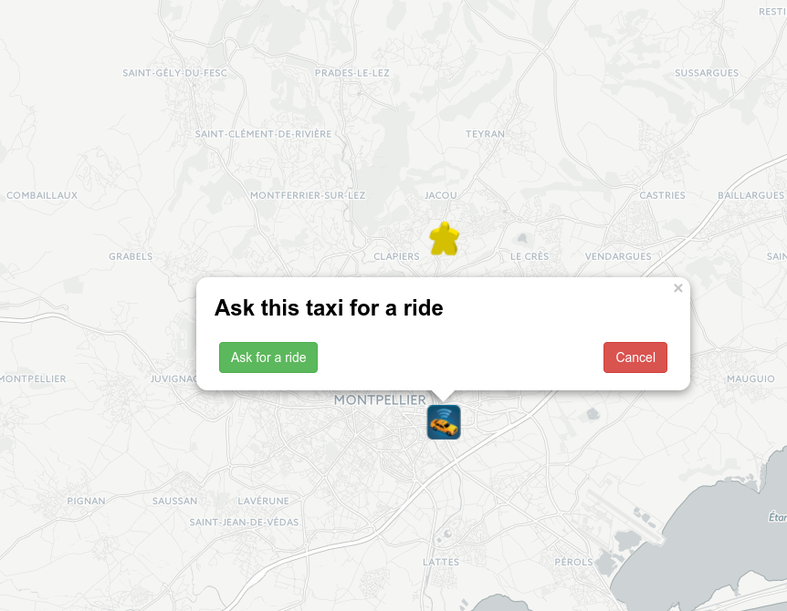
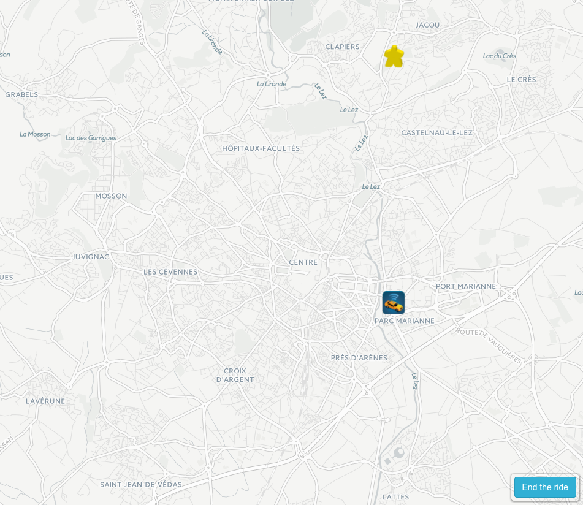

# Kuzzle - Cabble tutorial

This demo will show you how to use the geolocalisation filtering fro Kuzzle.
It will also show you quite complex process to 


#Sketchup User interface Cabble in three screens.


This is the basic process in three sceens Cabble rely on.
Here, this is the customer who propose the ride, but it can be the taxi.

<span>
	<figure>
		
		<figcaption style="width:300px;" >Step 1 : a customer ask a taxi for a ride.</figcaption>  
	</figure>
</span>

<span>
	<figure>
		
		<figcaption style="width:300px;" >Step 2  :The taxi see in realtime the ride proposal. He can accept or decline it. </figcaption>  
	</figure>
</span>


<span>
	<figure>
		
		<figcaption style="width:300px;" >Step 3 : The ride has been accepted by the taxi. A blue button in bottom right position appears for both taxi and customer screen. 
		They can end the riden at anytime, and (in a futur version) give an evaluation to the ride. </figcaption>  
	</figure>
</span>


## Iconography

<figure>
	
	<figcaption>The icon for the customer.</figcaption>
</figure>

<figure >
	
	<figcaption >A customer asking for a ride.</figcaption>
</figure>

<figure>
	
	<figcaption >The icon for the customer.</figcaption>
</figure>
<figure>
	
	<figcaption >A taxi proposing a ride.</figcaption>
</figure>

<figure>
	
	<figcaption>The user has not choose ye betweeen a customer or beeing a taxi.</figcaption>
</figure>


# The three controllers 


The entry point for Cabble is [app.js](../src/app.js).
This file can be resume to the following snippet with Promise :

```javascript
	gisController.init()
		.then(userController.init)
		.then(kuzzleController.init);
```

Corresponding to  :

  * [`gisController`](../src/gisController.js) (gis is for Geolocalisation Information System) is devoted to map rendering and manipulating markers.
Cabble use [Leafletjs](http://leafletjs.com/) for rendering. gisController also use webAPI geolocalisation functionality.
After the `gisController.init` call, the user is geolocalised, and visible on the center of the newly rendered map with [Leafletjs](http://leafletjs.com/),
  * [`userController`](../src/userController.js) allow to deal with localstorage as a persistance user information data.
  After the `userController.init`, if a previous user exist in storage, his id and type are loaded,
  * [`kuzzleController`](../src/kuzzleController.js) is devoted to all the PubSub (Publication Subscription) with Kuzzle.
  After the `kuzzleController.init`, connection to Kuzzle for pubsub positions, user status, and rides are enabled.


We will focus on [`kuzzleController`](../src/kuzzleController.js). When some call will be done to the two other controllers (gisController and userController) we will explain brievely their meaning if ir is not self explanatory.

# The three collections in [`kuzzleController`](../src/kuzzleController.js)

Cabble deal with three collections :

```javascript
	CABBLE_COLLECTION_POSITIONS = 'cabble-positions',
	CABBLE_COLLECTION_USERS = 'cabble-users',
	CABBLE_COLLECTION_RIDES = 'cabble-rides';
```

* `CABBLE_COLLECTION_POSITIONS` will be used to synchronize all the users positions on the map. It will also be used to filter all the user from Cabble to only deal with the candidates fitting the bounding box from our current map view.
* `CABBLE_COLLECTION_USERS` will be used to send the change in user status (an user can choose to be a taxi first and then become a customer). In order to leave user focus on his goal, Cabble does not show Taxi if the user is a taxi and vice versa. 
* `CABBLE_COLLECTION_RIDES` will be used to send and update the ride status along it life cicle 


The init for kuzzleController is : 
```javascript
	return {
		init: function() {
			return new Promise(
				function(resolve, reject) {
					var user = userController.getUser();
					//this is the first time user is connected to Kuzzle,
					//Cabble ask an id user to Kuzzle
					if (!user.userId) {
						//createUser set the new id send from Kuzzle to user.
						kuzzleController.createUser(user, function() {
							kuzzleController.initPubSub();
							resolve();
						});
					} else {
						//user has been found in localstorage from userController
						kuzzleController.initPubSub();
						resolve();
					}
			});
	}
```

Cabble ask for Kuzzle to give to the current user an id if Cabble does not found one in localstorage (see fetchFromLocalStorage in userController for details).
Then Cabble init the publication subscriptions via initPubSub for the three collections :


```javascript
	initPubSub: function() {

		//positions collection
		kuzzleController.publishPositions();
		kuzzleController.subscribeToPositions();

		//users collection
		kuzzleController.subscribeToUsers();


		//rides collection
		kuzzleController.subscribeToRides();
	},
```
The three following sections will describe : 

 * the positions pub sub, 
 * the user pub sub, 
 * the ride pub sub, 

## Positions management
Positions collection allow to update the current position of the taxi and customer (publishPositions).
Cabble also use the geolocalisation filtering from Kuzzle to be aware of candidates in the user map bounding box (subscribeToPositions).

### publishPositions

Cabble has to send the positions changes for user in order to synchronize all positions in all other Cabble instance.
To keep it simple Cabble will send position every 3000 milliseconds : 
```javascript
	publishPositions: function() {
		setInterval(
			function() {
				gisController.getGeoLoc().
				then(gisController.setUserPosition).
				then(function() {
					var userPosition = gisController.getUserPosition();
					var userId = userController.getUserId();
					var userType = userController.getUserType();

					if (!userPosition) {
						console.log("no position for user");
						return;
					}
					if (!userType)
						return;

					//Cabble send a non perisistant document : our current position
					kuzzle.create(CABBLE_COLLECTION_POSITIONS, {
						userId: userId,
						type: userType,
						position: {
							lat: userPosition.lat,
							lon: userPosition.lng
						},
						roomName: userSubscribedRoom
					}, false);
				});
			}, 3000);
	}
```

Cabble get information about user id and type from `userController` , current positions from `gisController.geoLoc` and send 
it as a document with `kuzzle.create`. This document will be not persisted in Kuzzle (i.e last argument of `kuzzle.create` is `false`).

The `roomName` attribute is not important for the positions listening purpose. It is related to the user state change listening, and will be explain 
in the user management section.

### subscribeToPositions

Cabble must propose to the user some "candidates" for a ride in the curent map bounding box.

By candidates, we mean taxis if the current user is a customer and vice versa.

Before describing the susbcribing procedure, let enumerate all the events that can change this filetering.
Cabble has to change filtering for positions every time that user :

 * zoom or move into the map,
 * change the viewport size (by changing browser size, by changing his phone orientation, ...)
 * change from state taxi to customer (if user is a customer, he is interesting for taxi and vice versa, marker on map must reflect that).

To keep it simple, we will not listen to all these events but instead blindly force the filtering to be change every 1000 milliseconds.

```javascript
	// we remove deprecated timer if any first
	if (refreshFilterTimerSubPosition)
		clearInterval(refreshFilterTimerSubPosition);

	refreshFilterTimerSubPosition = setInterval(function() {
		//subscribe for candidates in bounding box for the current user type here.
		...
	}, 1000);
```


The subscribe filter for bounding box with the current use type is computed as follow :

```javascript
	var
		bound = gisController.getMapBounds(),
		user = userController.getUser(),
		filterUserType = userController.getCandidateType(),
		filter = {
			and: [{
			term: {
				type: filterUserType
				}
			}, {
				geoBoundingBox: {
				position: {
					top_left: {
						lat: bound.neCorner.lat,
						lon: bound.swCorner.lng
					},
					bottom_right: {
						lat: bound.swCorner.lat,
						lon: bound.neCorner.lng
						}
					}
				}
			}]
		};
```

Suppose that, looking for distants candidates, the user zoom out into the map.
Cabble does not want to keep tracking for previous deprecated positions change filtering.
To do so Cabble keep the id of the last subscribe and cancel it if exist :

```javascript
	//remove last deprecated subscribe :
	if (positionsSubscribeRoom) {
		kuzzle.unsubscribe(positionsSubscribeRoom);
	}
	//adding a new subscribe :
	positionsSubscribeRoom = kuzzle.subscribe(CABBLE_COLLECTION_POSITIONS, filter,
		....

```

Then Cabble will subscribe for positions change with our current filter.

```javascript
	function(error, message) {
		if (error) {
			console.error(error);
			return;
		}

		if (message.action == "create") {
			assocRoomToUser[message._source.roomName] = message._source.userId;
			var candidatePosition = message._source.position;
			var candidateType = message._source.type;
			var candidateId = message._source.userId;

			if (candidateType === userController.getUserType())
				return;
			gisController.addMarker(candidatePosition, candidateType, candidateId);
		}
	});
```

Like for publishPositions, Cabble track the roomName attribute, but this is unrelated to positions pubSub.
```javascript
	assocRoomToUser[message._source.roomName] = message._source.userId;
```
It will be used for the user management purpose who come next.


## Users management


### publishUsers

Every time the user choose to change between taxi and customer type, Cabble must update the user in localstorage (`userController`) and the view (`gisController`). Then Cabble send this information to Kuzzle (and so to all the others Cabble users as in subscribeToUsers).

```javascript
	publishUserType: function(userType) {
		if (!userType)
		return;

		userController.setUserType(userType).then(function() {
			gisController.setUserType(userType);
			kuzzle.update(CABBLE_COLLECTION_USERS, userController.getUser().whoami,
				function(error, response) {
					if (error) {
						console.log(error);
						return;
					}
					kuzzleController.subscribeToUsers();
					kuzzleController.subscribeToPositions();
				});
		});
	}
```


### subscribeToUsers


```javascript
	subscribeToUsers: function() {
			if (!userController.getUserType())
				return;

			var userStatus = {
				exists: {
					field: 'type'
						//type: [userController.getUserType() === "taxi" ? "customer" : "taxi"]
				}
			};
			if (userSubscribedRoom)
				kuzzle.unsubscribe(userSubscribedRoom);


			userSubscribedRoom = kuzzle.subscribe(CABBLE_COLLECTION_USERS, userStatus, function(error, message) {
				if (error) {
					console.error(error);
					return false;
				}

				//we are instersting to unscribe i.e user change status interest
				if (!message || message.action != "off")
					return;

				//if this user was not on our map nothing to do
				var userWithSameStatus = assocRoomToUser[message.roomName];
				if (!userWithSameStatus)
					return;
				//else we remove it from the map
				gisController.removeCandidate(userWithSameStatus);
				//if we where aslo in a ride with this candidate, we must break it
				if (currentRide &&
					(currentRide._source.taxi === userWithSameStatus || currentRide._source.customer === userWithSameStatus)) {
					kuzzleController.finishRide();
				}
			});
		}
```

## Rides management


(a ride is first proposed than it can be canceled by user , declined (because user is already in an other ride) or accepted and finally finished).

## subscribeToRides

## publishRides

